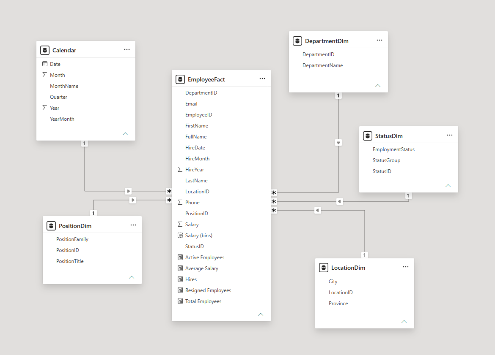
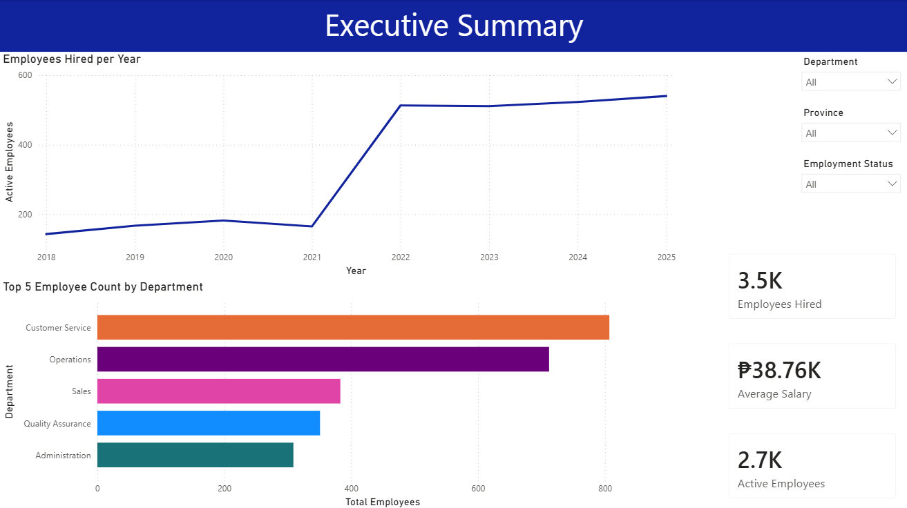
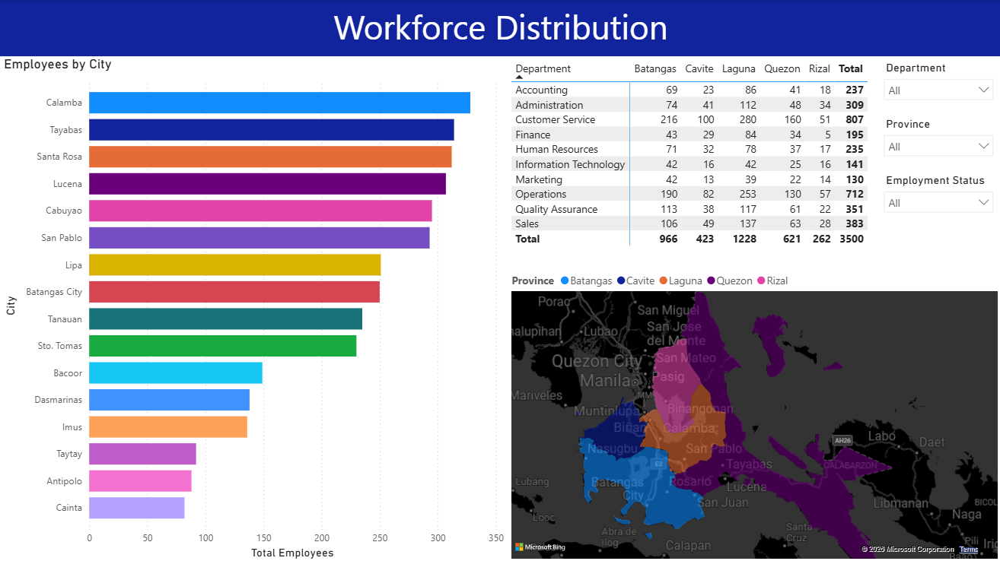
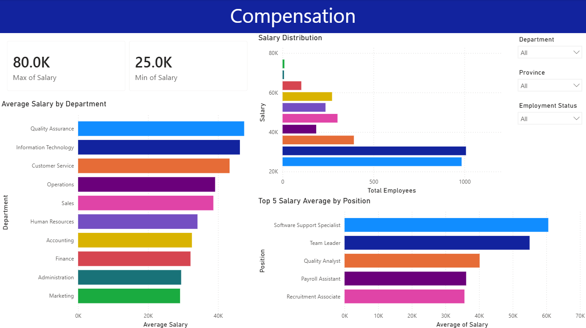
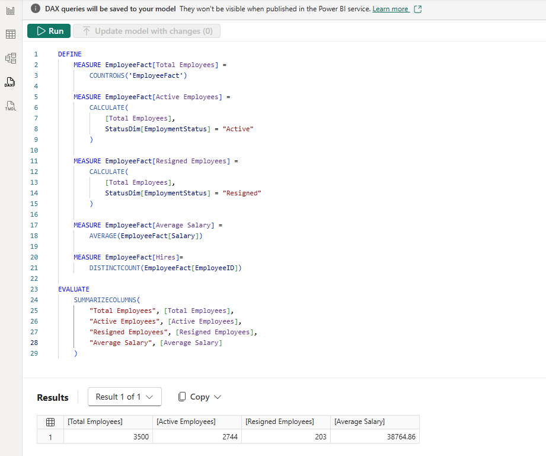

# BrightPath Solutions Inc. Power BI Dashboard Documentation

This document describes the BrightPath Solutions Inc. Power BI dashboard project and its contents. It is intended as a public-facing summary of the report structure, data model, visuals, and core analytical elements.

## 1. Project Overview

This dashboard was created to present employee-related workforce data in a clear, interactive reporting format. The report combines employee records, location information, department references, and compensation data into a single Power BI experience that supports analysis across multiple dimensions.

The report is organized around three main themes:

- workforce overview and hiring activity
- workforce distribution by location and department
- compensation patterns across roles and teams

---

## 2. Project Files

The project includes the following main files:

- [Dashboard.pbix](Dashboard.pbix) — the Power BI dashboard file
- [README.md](README.md) — this documentation file

These files together provide a complete view of the dashboard solution and its supporting documentation.

---

## 3. Data Model

The dashboard uses a relational data model built around a central employee fact table and supporting dimension tables.

### Core Tables
- EmployeeFact — employee-level records used as the primary fact table
- DepartmentDim — department reference data
- LocationDim — location and province reference data
- PositionDim — position reference data
- StatusDim — employment status reference data
- Calendar — date table used for time-based analysis

### Relationship Structure
The relationships between these tables support filtering and aggregation across the report. This allows visuals to respond consistently to slicers and selections made by the user.



---

## 4. Dashboard Pages

The report contains three main pages.

### Page 1: Executive Summary
This page provides a high-level overview of the workforce.

Included visuals:
- employees hired over time
- department-level workforce comparison
- KPI cards for key workforce metrics



### Page 2: Workforce Distribution
This page focuses on the geographic and organizational spread of employees.

Included visuals:
- employee count by city
- department and location breakdown
- geographic view of workforce concentration



### Page 3: Compensation
This page highlights salary-related patterns across the organization.

Included visuals:
- minimum and maximum salary cards
- average salary by department
- salary distribution analysis
- average salary by position



---

## 5. Report Design

The dashboard was designed to be straightforward and presentation-friendly.

### Layout and Navigation
- the report uses a consistent structure across all pages
- slicers are included to filter results by department, province, and employment status
- visuals are organized so the report can be reviewed from a broad summary down to more detailed analysis

### User Experience
The report is intended to support quick review of workforce and compensation insights while remaining easy to use for business audiences.

---

## 6. DAX Measures

The dashboard includes DAX measures to support its visuals and calculations.

Example measures include:

```dax
Total Employees = DISTINCTCOUNT(EmployeeFact[EmployeeID])

Average Salary = AVERAGE(EmployeeFact[Salary])

Active Employees = CALCULATE(DISTINCTCOUNT(EmployeeFact[EmployeeID]), StatusDim[Status] = "Active")
```

These measures allow key metrics to update correctly based on filters and selections in the report.



---

## 7. Summary

This Power BI dashboard presents a structured view of employee data through a relational model, interactive visuals, and business-focused reporting. It demonstrates a practical approach to transforming raw data into a usable analytical dashboard for workforce and compensation review.
