# BrightPath Solutions Inc. Power BI, Power Apps & Power Automate Documentation

This project demonstrates a simple employee data solution using Power BI, Power Apps, and Power Automate. The project covers workforce reporting, employee lookup, employee update requests, and an approval workflow.

---

## 1. Project Overview

This project was created to present employee-related workforce data in a clear and interactive format while also demonstrating how the same data can be used in a simple Power Platform workflow.

The solution is organized around three main areas:

- workforce reporting and analysis in Power BI
- employee lookup and update requests in Power Apps
- request approval and workflow automation in Power Automate

Power BI is used to analyze the employee dataset, Power Apps provides an interface for viewing employees and submitting proposed changes, and Power Automate handles the approval process for those requests.

---

## 2. Project Files

The core files for this project are:

- `Dashboard.pbix` — the Power BI dashboard file
- `README.md` — this documentation file

The employee data and request data are used as the data sources for the Power BI and Power Apps portions of the project.

---

# Power BI

## 3. Data Model

The reporting solution uses a relational structure built around an employee fact table and supporting dimension tables. This model makes the data easier to analyze and supports consistent filtering across the dashboard.

### Core Tables

- `EmployeeFact` — employee-level records used as the primary fact table
- `DepartmentDim` — department reference data
- `LocationDim` — location and province reference data
- `PositionDim` — position reference data
- `StatusDim` — employment status reference data
- `Calendar` — date table used for time-based analysis

### Relationship Structure

The relationships between these tables allow the report to filter and aggregate employee information across departments, positions, locations, employment status, and dates.


*Shows the Power BI data model and the relationships between the employee fact table and supporting dimension tables.*

---

## 4. Dashboard Pages

The report contains three main pages, each focused on a different part of the workforce story.

### Page 1: Executive Summary

This page provides a high-level overview of the workforce.

Included visuals:

- employees hired over time
- department-level workforce comparison
- KPI cards for key workforce metrics


*Shows the main workforce KPIs and summary visuals used to provide a quick overview of the organization.*

### Page 2: Workforce Distribution

This page focuses on the geographic and organizational distribution of employees.

Included visuals:

- employee count by city
- department and location breakdown
- geographic view of workforce concentration


*Shows how employees are distributed across departments, cities, and other geographic areas.*

### Page 3: Compensation

This page focuses on salary-related patterns across the organization.

Included visuals:

- minimum and maximum salary cards
- average salary by department
- salary distribution analysis
- average salary by position


*Shows the salary-related metrics and visuals used to compare compensation across departments and positions.*

---

## 5. Report Design

The dashboard was designed to be straightforward and easy to navigate.

### Layout and Navigation

- the report uses a consistent structure across all pages
- slicers are included to filter results by department, province, and employment status
- visuals are organized from high-level metrics to more detailed analysis

### User Experience

The report is designed to help users quickly review workforce and compensation information while allowing them to explore the data through filters and interactive visuals.

---

## 6. DAX Measures

The dashboard uses DAX measures to support its visuals and calculations.

Example measures include:

```dax
Total Employees = DISTINCTCOUNT(EmployeeFact[EmployeeID])

Average Salary = AVERAGE(EmployeeFact[Salary])

Active Employees = CALCULATE(
    DISTINCTCOUNT(EmployeeFact[EmployeeID]),
    StatusDim[EmploymentStatus] = "Active"
)
```

These measures allow key metrics to respond to filters and selections made in the report.


*Shows the DAX measures created to support the dashboard's key metrics and calculations.*

---

# Power Apps

## 7. Employee Lookup and Update Request App

The Power Apps component provides a simple interface for searching employee records and submitting proposed employee data changes.

The application allows users to:

- search employees by name or employee ID
- filter employees by department and province
- view employee details
- edit proposed employee information
- provide a reason for requested changes
- submit an employee update request

The application does not directly change the original employee record. Instead, it creates a separate request containing the original values and the proposed changes.

---

## 8. Employee Search

The Employee Search screen allows users to locate employees from the employee dataset.

Users can search using an employee's first name, last name, or employee ID. Department and province dropdowns can also be used to narrow the results.

Matching employees are displayed in a gallery.

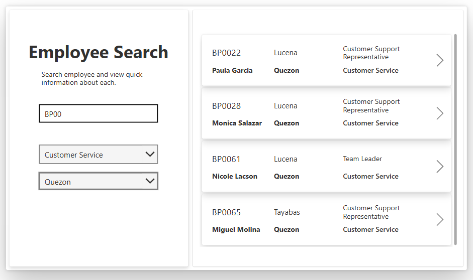

*Shows the employee search screen with the search field, department and province filters, and employee results gallery.*

---

## 9. Employee Details

After selecting an employee from the search results, the application opens the Employee Detail screen.

The screen displays information such as:

- employee ID
- first name
- last name
- email
- phone
- department
- position
- city
- province
- hire date
- hire year
- salary
- employment status

The screen also contains an **Edit Employee** button that opens the update request interface.

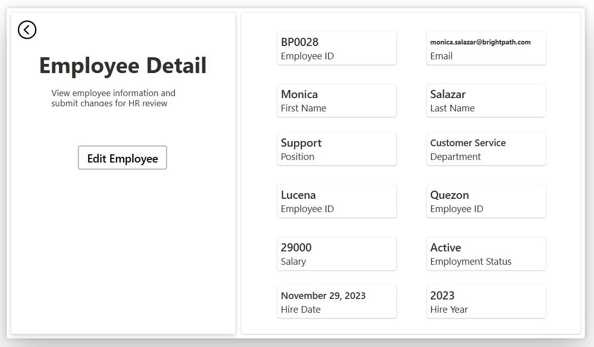

*Shows the selected employee's information in a structured detail view before a user submits a change request.*

---

## 10. Employee Update Request

The Edit Employee screen uses the selected employee's existing information as the starting point for a proposed change.

Users can edit fields including:

- first name
- last name
- email
- phone
- department
- position
- city
- province
- salary
- employment status

A comments field is required before the request can be submitted.

The application records both the original employee values and the proposed new values in the `EmployeeRequests` data source.

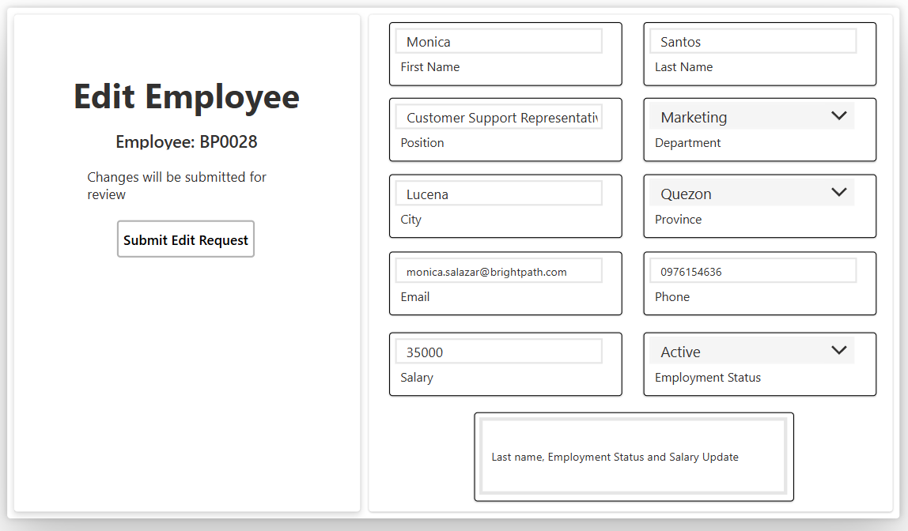

*Shows the editable employee fields and comments section used to create an employee update request.*

---

## 11. Request Submission

When the user submits the request, Power Apps creates a new record in the `EmployeeRequests` data source.

The request contains the employee information, original values, proposed values, and comments explaining the requested change.

The application then sends the request information to Power Automate for approval.

After the workflow finishes, Power Apps displays the result to the user.

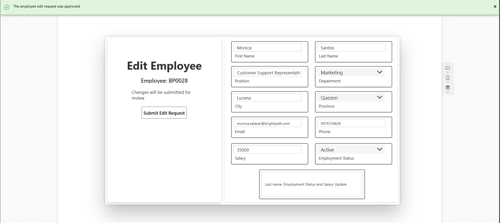

*Shows the Power Apps result after an employee update request has been approved.*

A rejected request is handled separately and returns a rejected result to the application.

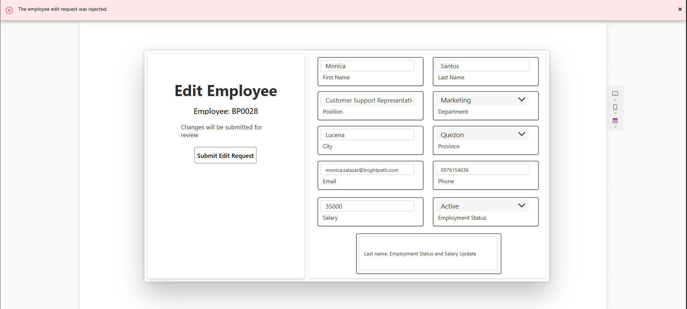

*Shows the Power Apps result after an employee update request has been rejected.*

---

# Power Automate

## 12. Request Approval Workflow

Power Automate handles the approval process for employee update requests submitted through Power Apps.

The workflow follows this basic process:

1. receive the request from Power Apps
2. pass the request information to an approval
3. wait for the reviewer to respond
4. check whether the request was approved or rejected
5. return the result to Power Apps

This creates a simple automated approval process for employee data changes.

---

## 13. Workflow Structure

The complete flow connects the Power Apps trigger, approval action, condition, and response actions.

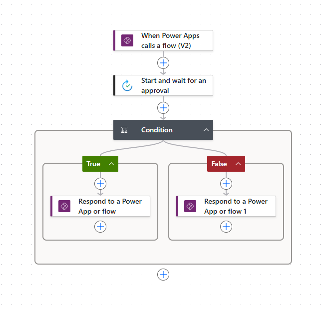

*Shows the complete Power Automate workflow from the Power Apps trigger through the approval, decision condition, and response.*

---

## 14. Power Apps Trigger

The workflow starts with the **Power Apps (V2)** trigger.

The trigger receives information from the Power Apps application, including the request and the proposed employee changes.

The inputs include information such as:

- Request ID
- Employee ID
- employee name
- comments
- old and new department
- old and new position
- old and new city
- old and new province
- old and new salary

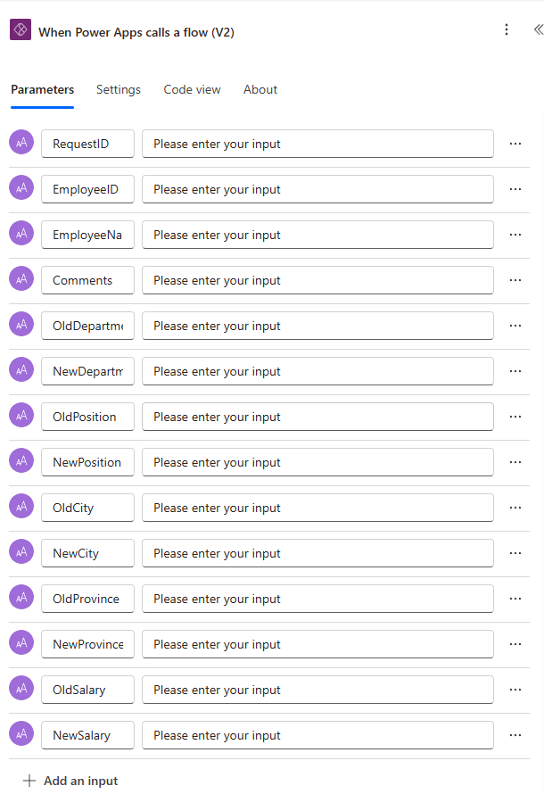

*Shows the Power Apps (V2) trigger and the input parameters passed from Power Apps to Power Automate.*

---

## 15. Approval Configuration

After receiving the request, Power Automate starts an approval using the **Approve/Reject - First to respond** approval type.

The approval includes the employee information, proposed changes, and reason for the request.

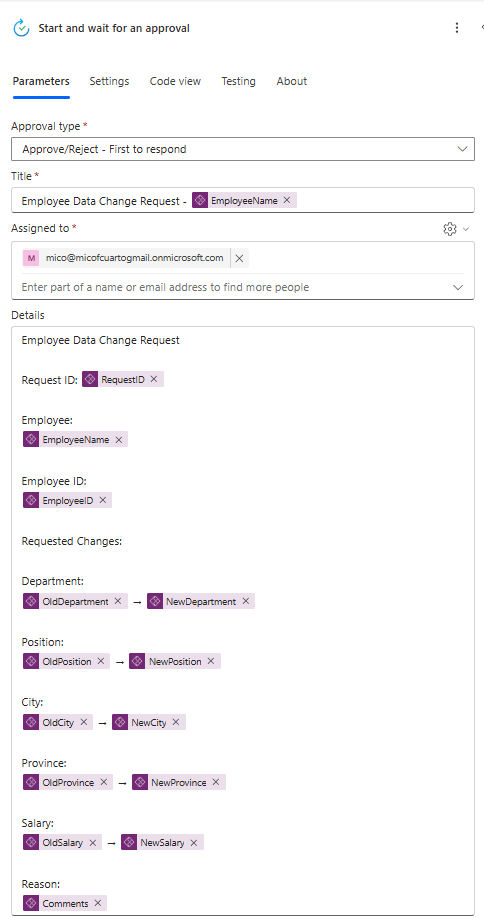

*Shows the approval action and the information provided to the reviewer.*

---

## 16. Approval Request

The reviewer receives the employee update request and can choose either **Approve** or **Reject**.

The request provides the information needed to review the proposed changes.

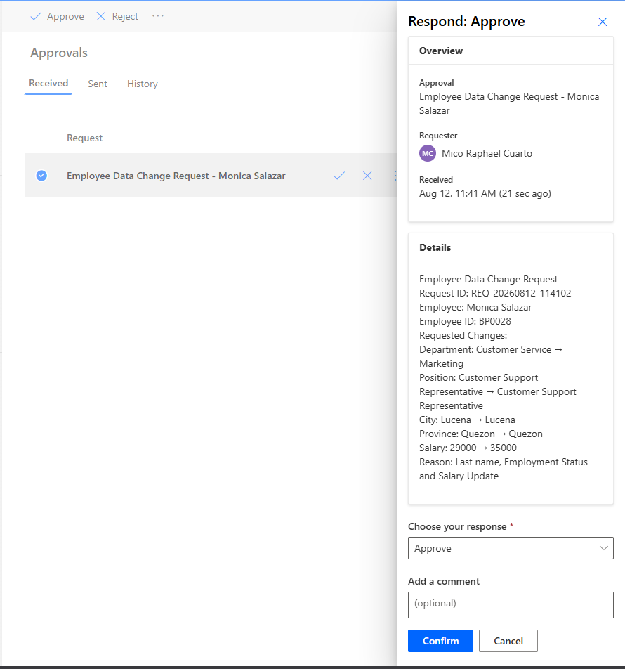

*Shows an actual approval request presented to the reviewer, including the employee information and proposed changes.*

---

## 17. Approval Outcome

After the reviewer responds, Power Automate evaluates the approval result using a condition.

If the request is approved, the flow follows the approved branch. If the request is rejected, the flow follows the rejected branch.

The result is then returned to Power Apps.

### Approved Request

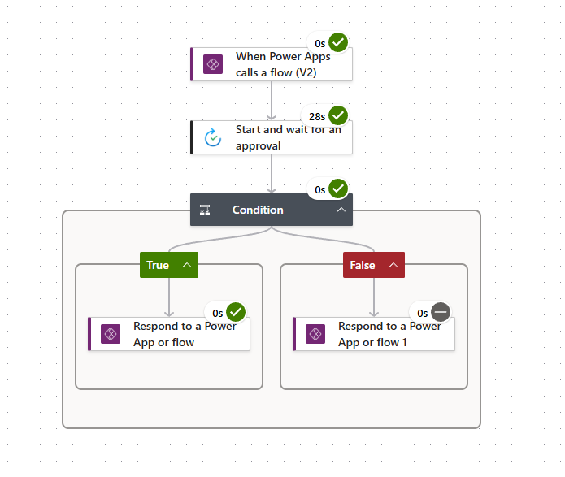

*Shows a completed Power Automate run where the request followed the approved branch successfully.*

### Rejected Request

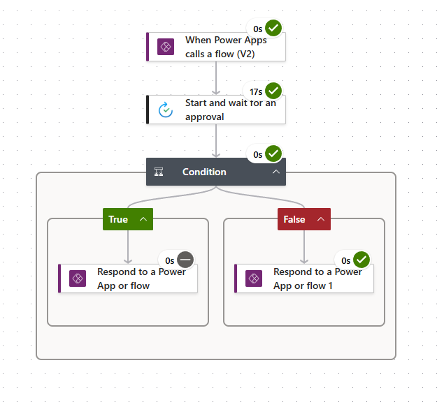

*Shows a completed Power Automate run where the request followed the rejected branch.*

These two runs demonstrate that the workflow can handle both possible approval outcomes.

---

# Employee Request Data

## 18. EmployeeRequests

Submitted requests are stored separately from the original employee data.

The `EmployeeRequests` structure contains the employee identifier, original values, proposed values, comments, and other request information.

The request fields include:

- `RequestID`
- `EmployeeID`
- `EmployeeName`
- `Comments`
- `OldFirstName`
- `NewFirstName`
- `OldLastName`
- `NewLastName`
- `OldEmail`
- `NewEmail`
- `OldPhone`
- `NewPhone`
- `OldDepartment`
- `NewDepartment`
- `OldPosition`
- `NewPosition`
- `OldCity`
- `NewCity`
- `OldProvince`
- `NewProvince`
- `OldSalary`
- `NewSalary`
- `OldEmploymentStatus`
- `NewEmploymentStatus`
- `Status`
- `ReviewerComments`

Keeping the original and proposed values in separate fields makes it possible for the reviewer to clearly compare what was changed.

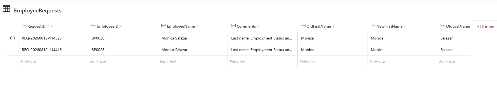

*Shows a submitted employee request containing the original employee values, proposed changes, and request information.*

---
